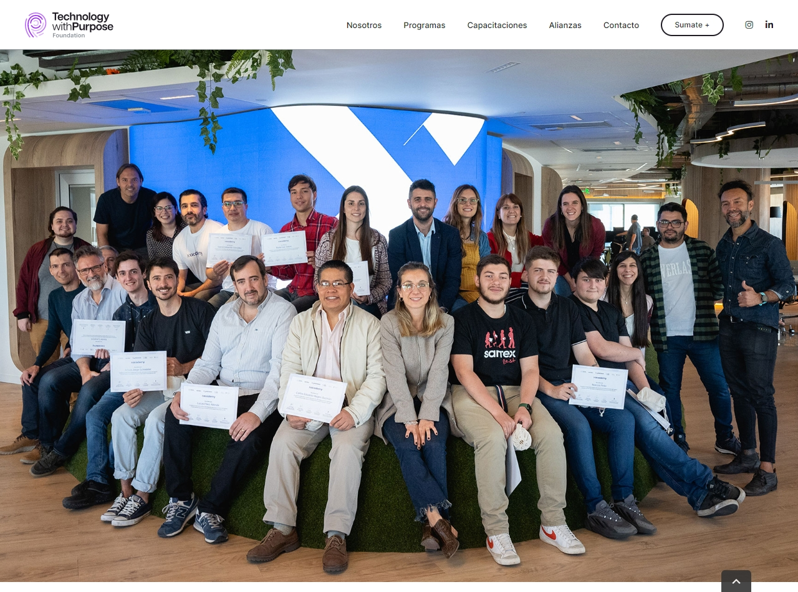

 🧑‍💻 Imitacion de la Maquetacion del Home Xacademy solo HTML y CSS  🧑‍💻
 
 ✔️ Implementado por Arguello Soledad -> [ver Github](https://github.com/sole-arguello)

<h2> Demo: https://superb-vacherin-e39eed.netlify.app </h2>

# Santex Academy

XAcademy es un programa de formación en programación nativo llevado adelante por la Fundación Tecnología con Propósito junto a Santex que busca promover un cambio positivo en la comunidad a través de la educación en IT, apuntando a lograr la inserción laboral de personas en el mundo tecnológico. 

  

  
## ✔️ Implementacion
  
